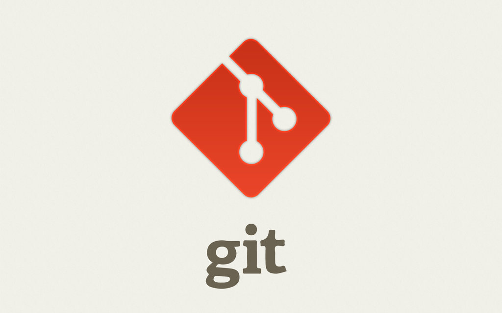

# GIT

## Permasalahan

- Handling Source Code.
- Collaborating Project.

## Apa itu GIT?

Git adalah salah satu sistem pengontrol versi (Version Control System) pada proyek perangkat lunak yang diciptakan oleh Linus Torvalds.

## Non Git vs Git

### Non Git

### Git

## Kenapa Penting Git Bagi Programmer?

1. Kontrol Versi.
2. Kolaborasi Projek.
3. Bisa ikut Kontribusi.
4. Lebih aman.
5. Dll.

-----

### [Instalasi Git dan Konfigurasi](install.html)